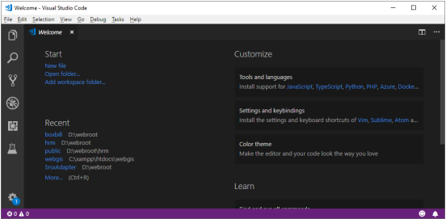
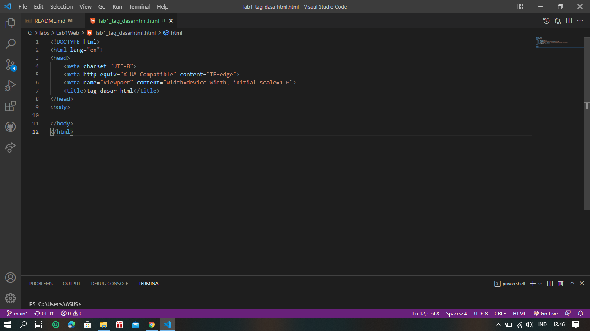

# Lab1Web

## NAMA : Ibnu fajar 
## NIM  : 312010420
## KELAS: TI. 20. A1

Saya ibnu fajar akan menjelaskan pemprograman dasar HTML sebagai berikut:
  Langkah pertama kalian buka Visual Studio Code

  Langkah kedua kalian harus membuat file dengan nama <b>lab1_tag_dasarhtml
 divisual studio code, seperti gambar berikut:
