# Lab1Web

## NAMA : Ibnu fajar 
## NIM  : 312010420
## KELAS: TI. 20. A1

Saya ibnu fajar akan menjelaskan pemprograman dasar HTML sebagai berikut:
  Langkah pertama kalian buka Visual Studio Code

  Langkah kedua kalian harus membuat file dengan nama <b>lab1_tag_dasarhtml</b> divisual studio code, seperti gambar berikut:

  lalu kalian buka digoogle crome dan lihat hasilnya
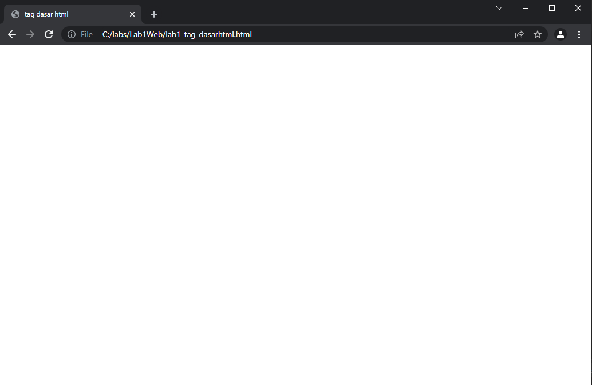

  langkah keempat kalian belajar membuat paragraf seperti codingan digambar berikut
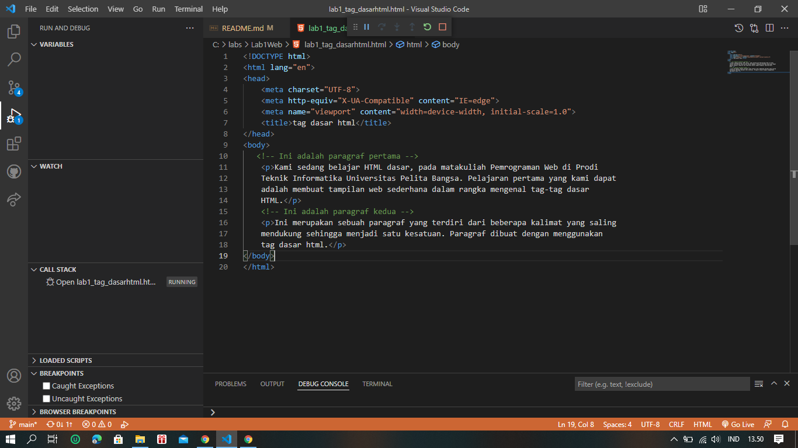
ketika sudah membuat codingan paragraf lalu kalian run divisual studio code, dan kalian buka digoogle crome lalu refres dan lihat hasilnya
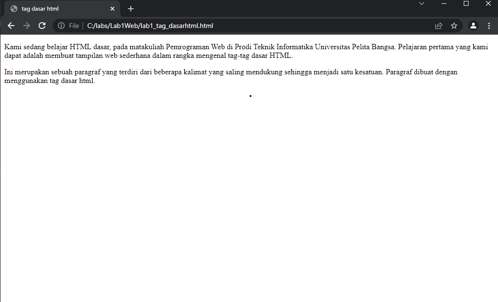
  Kemudian atur atribut paragraf seperti gambar dibawah ini, dan amati perubahanya.
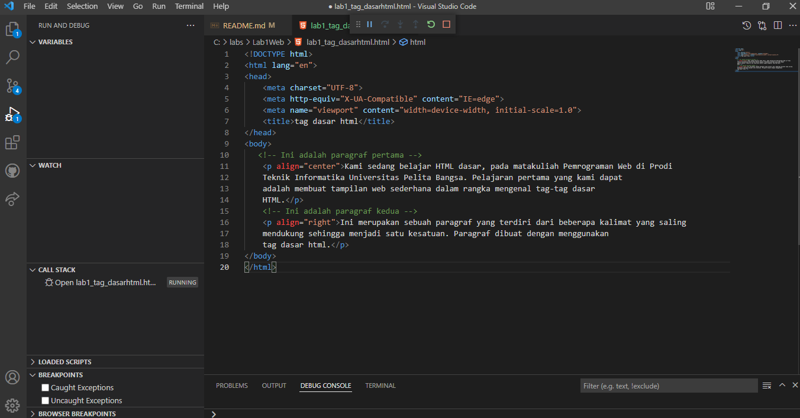
Simpan kembali dan amati perubahannya dengan melakukan refresh pada google crome.
Selanjutnya silakan ubah-ubah nilai atributnya (align => justify, left, right, dan center) untuk melihat
perbedaan lainnya.
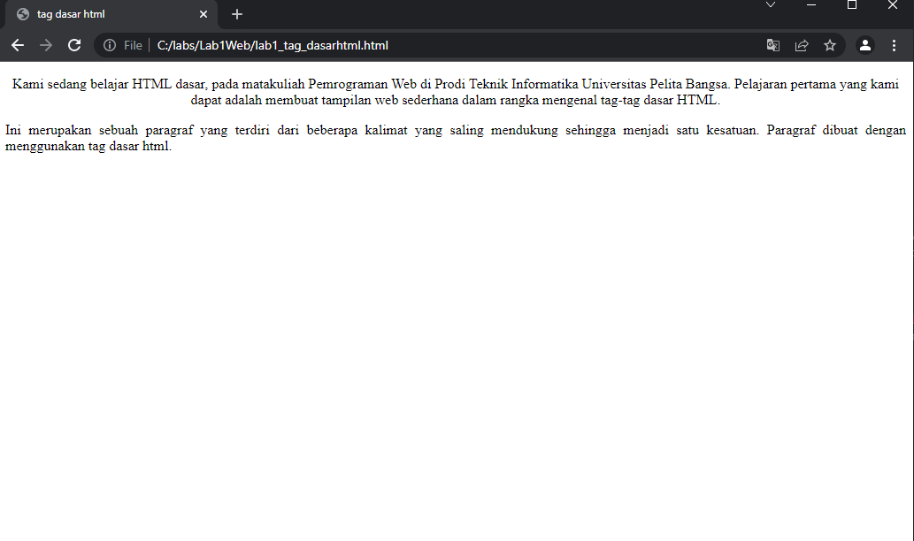

  langkah kelima kalian belajar menambahkan judul seperti, tambahkan judul h1 sebelum paragraf pertama dan tambahkan sub judul h2 sebelum paragraf kedua. Seperti codingan digambar berikut
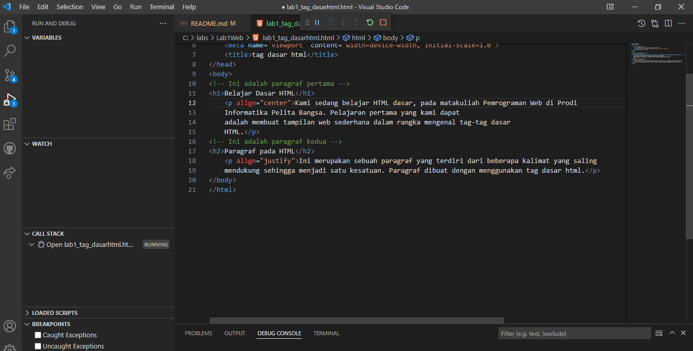
   ketika sudah membuat codingannya lalu kalian run divisual studio code, dan kalian buka digoogle crome lalu refres dan lihat hasilnya
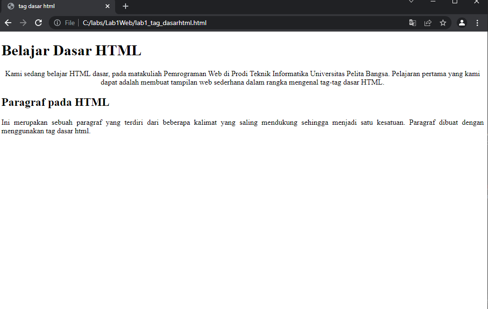

  langkah keenam kalian belajar melakukan pemformatan teks yang pada paragraf yang sudah ada sebelumnya, seperti codingan digambar berikut
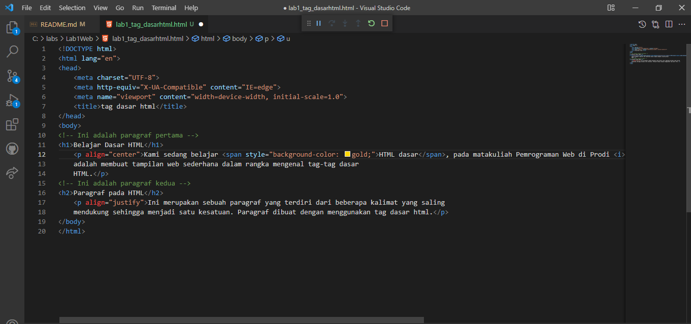
  ketika sudah membuat codingannya lalu kalian run divisual studio code, dan kalian buka digoogle crome lalu refres dan lihat hasilnya
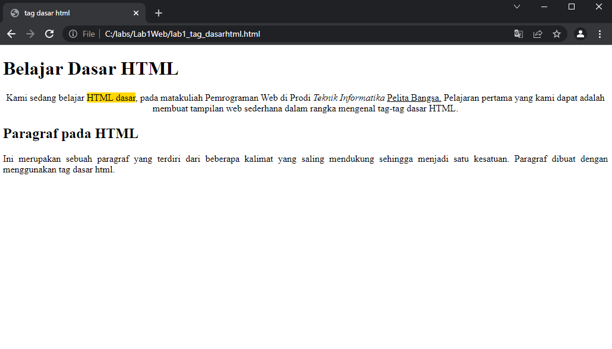

  langkah ketujuh kalian belajar menyisipkan gambar pada halam Web, kemudian simpan file gambar tersebut satu folder dengan file dokumen html seperti gambar berikut;
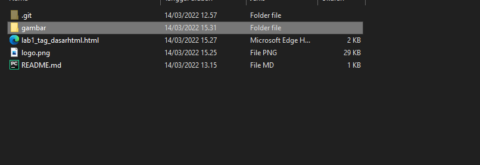
  langkah selanjutnya menambahkan codingan seprti gambar dibawah ini;
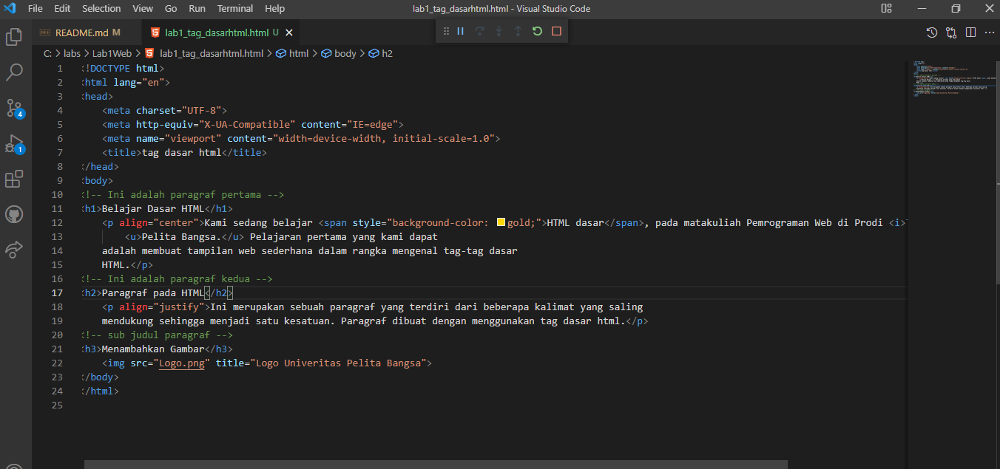
  setelah membuat codingannya lalu kalian run divisual studio code, dan kalian buka digoogle crome lihat hasilnya
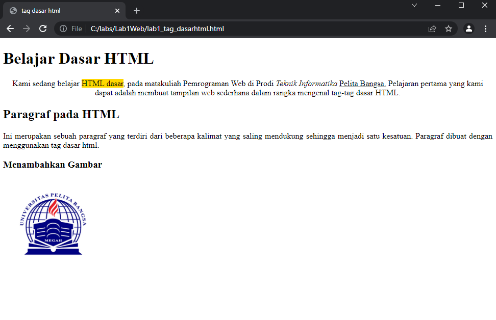 

<b>Demikian kiranya yang bisa saya sampaikan, kurang lebihnya saya mohon maaf jika ada salah kata yang terucap, dan atas perhatiannya saya ucapkan terima kasih yang sebesar-besarnya.</b>

